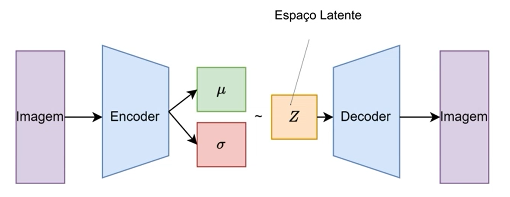
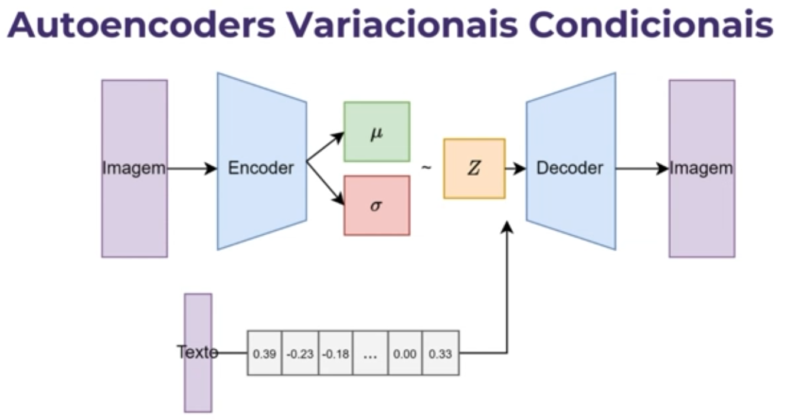

# Explicação Didática VAE

### O que a imagem representa?

Ela mostra o fluxo de dados em um **Variational Autoencoder (VAE)** aplicado para imagens:

1. **Imagem** de entrada é passada para o **Encoder**.
2. O Encoder gera dois vetores:

   * $\mu$ (média)
   * $\sigma$ (desvio padrão)
3. Esses parâmetros definem uma distribuição probabilística no **espaço latente** (representado pela variável aleatória $z$).
4. Um ponto $z$ é amostrado a partir dessa distribuição $\mathcal{N}(\mu, \sigma^2)$.
5. Esse ponto $z$ é passado para o **Decoder**.
6. O Decoder gera uma **imagem reconstruída** a partir de $z$.

---

# Detalhes e Fórmulas do VAE

---

### 1. **Encoder**

O Encoder recebe a imagem $x$ e produz os parâmetros da distribuição latente $q_\phi(z|x)$:

$$
\mu = f_\mu(x), \quad \sigma = f_\sigma(x)
$$

Essas funções $f_\mu$ e $f_\sigma$ são redes neurais que aprendem a mapear a imagem para os parâmetros da distribuição normal multivariada $z$.

---

### 2. **Espaço Latente**

Ao invés de mapear diretamente a entrada para um ponto fixo, o VAE mapeia para uma **distribuição probabilística** no espaço latente:

$$
z \sim \mathcal{N}(\mu, \sigma^2)
$$

Ou seja, $z$ é uma variável aleatória amostrada da distribuição normal com média $\mu$ e variância $\sigma^2$.

Para permitir a retropropagação durante o treino, usa-se a **reparametrização**:

$$
z = \mu + \sigma \odot \epsilon, \quad \epsilon \sim \mathcal{N}(0, I)
$$

onde $\odot$ é o produto elemento a elemento, e $\epsilon$ é um ruído amostrado da normal padrão.

---

### 3. **Decoder**

O Decoder tenta reconstruir a imagem original a partir do vetor latente $z$, gerando:

$$
\hat{x} = g_\theta(z)
$$

onde $g_\theta$ é uma rede neural que gera a reconstrução.

---

### 4. **Função de perda do VAE**

O objetivo do VAE é maximizar a evidência do dado (log-likelihood) e regularizar o espaço latente para que ele siga uma distribuição normal padrão.

A função de perda tem dois termos principais:

$$
\mathcal{L}(\theta, \phi; x) = \underbrace{\mathbb{E}_{q_\phi(z|x)} [ \log p_\theta (x|z) ]}_{\text{Reconstruction loss}} - \underbrace{D_{KL}(q_\phi(z|x) \parallel p(z))}_{\text{Regularização}}
$$

* **Reconstrução**: mede o quanto a imagem reconstruída $\hat{x}$ é próxima da original $x$.
* **KL Divergência**: mede a diferença entre a distribuição aproximada $q_\phi(z|x) = \mathcal{N}(\mu, \sigma^2)$ e a distribuição prior $p(z) = \mathcal{N}(0, I)$. Isso força o espaço latente a ser próximo da normal padrão, o que é útil para gerar amostras coerentes.

A divergência de Kullback-Leibler para distribuições normais tem fórmula analítica:

$$
D_{KL}(\mathcal{N}(\mu, \sigma^2) \parallel \mathcal{N}(0,1)) = -\frac{1}{2} \sum_{j=1}^d \left(1 + \log(\sigma_j^2) - \mu_j^2 - \sigma_j^2 \right)
$$

---

# Explicação da Imagem: Autoencoders Variacionais Condicionais (CVAE)

### Fluxo básico do CVAE na imagem:

1. **Entrada imagem** → passa pelo **Encoder** que gera $\mu$ e $\sigma$.
2. O vetor latente $z$ é amostrado a partir da distribuição normal parametrizada por $\mu$ e $\sigma$.
3. Agora, o **texto** também é processado e representado como um vetor numérico (embedding) — por exemplo, um vetor de floats $[0.39, -0.23, \ldots, 0.33]$.
4. Esse vetor de texto é **concatenado** (ou combinado de outra forma) com $z$.
5. O vetor combinado $(z, \text{embedding de texto})$ é passado para o **Decoder**.
6. O Decoder gera uma nova **imagem condicionada** ao texto fornecido.

---

### O que muda no CVAE em relação ao VAE padrão?

No VAE tradicional, o espaço latente $z$ codifica apenas a informação da imagem original para gerar a reconstrução.

No **CVAE**, o espaço latente é condicionado por uma informação extra $c$ (neste caso, o texto), para que o modelo possa controlar o output com base nessa informação extra.

A modelagem muda de:

$$
p_\theta(x|z)
$$

para:

$$
p_\theta(x|z, c)
$$

onde $c$ é a condição — o vetor de texto.

---

### Como o texto é incorporado?

* O texto é transformado em um vetor de características usando técnicas como **word embeddings** (ex: Word2Vec, GloVe, FastText) ou embeddings mais sofisticados (ex: BERT).
* Esse vetor é uma representação numérica do significado do texto.
* Depois, o vetor texto é **concatenado** com o vetor latente $z$, ou inserido de alguma forma no Decoder.
* Isso permite que o Decoder gere imagens que correspondem à condição textual.

---

### Formulação matemática do CVAE:

* Encoder aproxima a distribuição posterior condicionada $q_\phi(z|x, c)$ (aqui $c$ é o texto).
* Decoder gera a imagem condicional $p_\theta(x|z, c)$.
* A função de perda é uma extensão da do VAE, incluindo a condição $c$:

$$
\mathcal{L}(\theta, \phi; x, c) = \mathbb{E}_{q_\phi(z|x, c)} [ \log p_\theta(x|z, c)] - D_{KL}(q_\phi(z|x, c) \parallel p(z|c))
$$

---

### Aplicação prática:

* Se você quiser gerar uma imagem específica, por exemplo, "gato preto", você fornece o texto "gato preto" para o modelo.
* O modelo transforma esse texto em vetor $c$, que influencia diretamente o espaço latente.
* Ao amostrar $z$ e passar $(z, c)$ pelo Decoder, o modelo gera imagens coerentes com a descrição "gato preto".
* Assim, é possível controlar a geração das imagens via texto, criando um modelo **gerador condicionado**.

---

### Resumo final:

* **Texto → embedding numérico**
* **Imagem → Encoder → $\mu, \sigma$ → $z$ amostrado**
* **Concatenação**: $z$ + embedding de texto
* **Decoder recebe** o vetor combinado e gera imagem condicionada